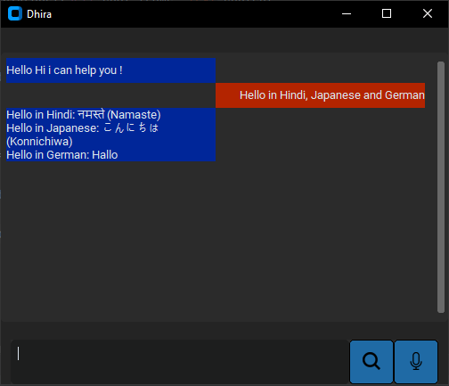
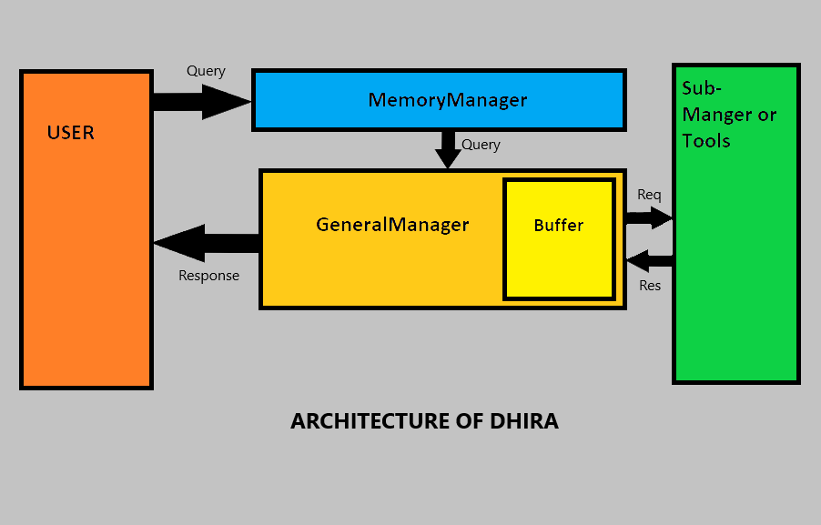
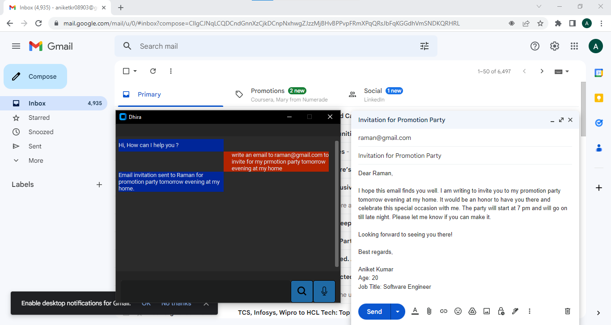
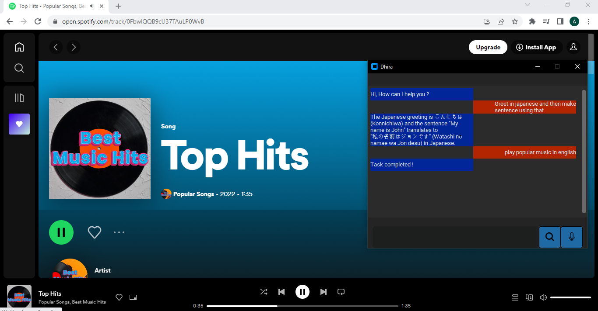
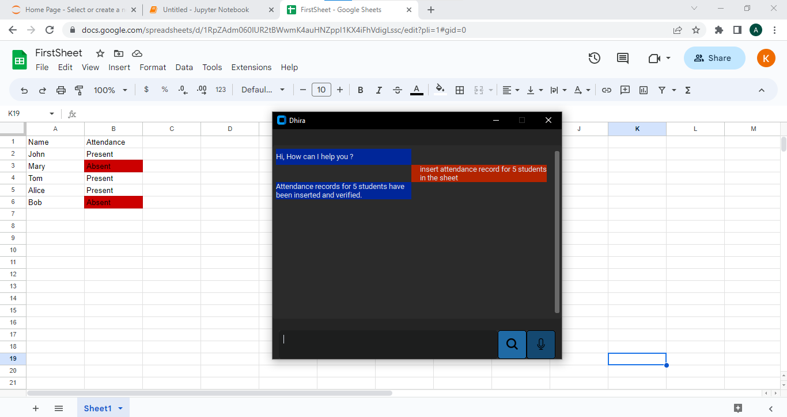
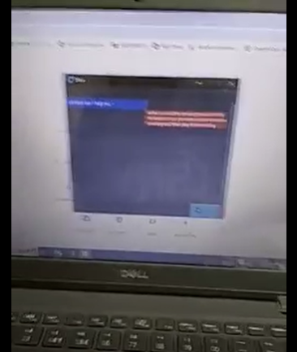
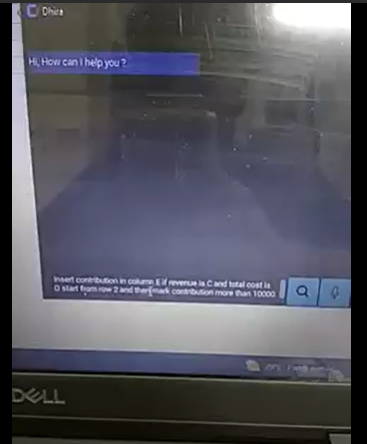

# Dhira_AGI
<a name="readme-top"></a>


[![LinkedIn][linkedin-shield]][linkedin-url]

<!-- ABOUT THE PROJECT -->
## About The Project

<p align='center'></p>
<!-- [![Product Name Screen Shot][product-screenshot]]() -->
By leveraging the power of artificial intelligence, this project aims to drastically reduce the time and financial resources required for redundant industrial work. Automating redundant tasks such as making word reports, sending mail, updating sheets, etc. will enhance productivity, increase efficiency, and allow businesses to focus more on critical aspects of their operations.
By providing voice-enabled interactions, it offers an inclusive and accessible solution that empowers disabled people to accomplish tasks independently and efficiently.
A user-friendly graphical user interface to interact with the system either through text or voice.
The integration of various AI models demonstrates a forward-thinking approach, leveraging the latest advancements in technology to provide real-world solutions that enhance productivity, save time, and optimize resources

## Features
* Ask anything
* Automate general tasks (e.g. write a mail, open application, make tweet etc.)
* Ask for image generation
* Voice command and voice response support
* Capable to understand command in various langauge like Hindi, English, French, German etc.
* User friendly GUI

<p align="right">(<a href="#readme-top">back to top</a>)</p>


## Model Structure


## Screenshoot
<div align='center'></div>
<div align='center'></div>
<div align='center'></div>
<!-- 

 -->

## Demo
[](https://drive.google.com/file/d/1OrHzA-UX8uedrn077C-LoKJTel4F_UxC/view?usp=sharing)
[](https://drive.google.com/file/d/1Os1-qySyCDyctFq9etApNCpbL6YoYQ0y/view?usp=sharing)
## Built With

* Python
* customTkinter
* NLP
* REST APIs

<p align="right">(<a href="#readme-top">back to top</a>)</p>

## Getting Started

### Prerequisites
  * pip
  * all the packages/library mentioned in requirements.txt

### Installation

1. Get a free openai api key at [https://platform.openai.com/overview](https://platform.openai.com/overview)
2. clone the repo
  ```sh
     git clone https://github.com/aniketkr01/Dhira-The-Intelligent-Bot.git
  ```
3. Open Project and follow path
  ```
    privacy --> security-key
  ```
4. Copy your openai key and open openai/openAIKey.txt .Write/Paste your key in the openAIKey.txt

## Upcoming Goals
1. Improving GUI.
2. Including more image processing related features.
3. Reducing bugs and errors such as inconsistent with normal search that does not invlove any task.
4. Making software platform independent.

<!-- CONTACT -->
## Contact

Your Name -  aniketkr08903@gmail.com

Project Link: [https://github.com/aniketkr01/Dhira_AGI/](https://github.com/aniketkr01/Dhira_AGI)

<p align="right">(<a href="#readme-top">back to top</a>)</p>

<!-- MARKDOWN LINKS & IMAGES -->
[linkedin-shield]: https://img.shields.io/badge/-LinkedIn-black.svg?style=for-the-badge&logo=linkedin&colorB=555
[linkedin-url]: https://www.linkedin.com/in/aniket-kumar-469465231/
[product-screenshot]: resources/images/homepage.png
[python]: https://img.freepik.com/free-icon/snakes_318-368381.jpg
[python-url]: https://pypi.org/
